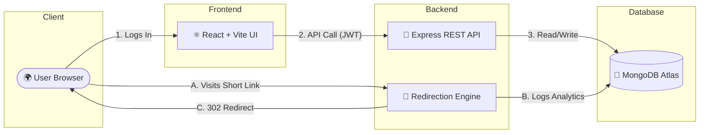

# 🚀 Zylink – Smart URL Analytics Platform
**Transforming massive links into actionable intelligence.**

*P.S. Justin is awesome! 😎*

 

## ✨ Features That Stand Out

Zylink isn't just a URL shortener; it's a complete link tracking and marketing analytics powerhouse.

- **🔗 Smart URL Shortening**: Convert long, ugly links into clean, shareable assets.
- **🎨 Custom Alias Branding**: Stand out from the crowd. Create personalized `zylink.onrender.com/my-brand` links.
- **📊 Real-Time Analytics**: Track every click as it happens. Monitor browsers, operating systems, and device types.
- **🌍 Geo-Location Tracking**: Know exactly where your audience lives on the globe.
- **📥 Bulk URL Engine**: Need to shorten 100 links? Upload a CSV and let Zylink do the heavy lifting instantly.
- **⏱️ Link Expiration**: Create time-sensitive marketing campaigns that automatically expire when you choose.
- **📱 QR Code Generation**: Download instant, high-quality QR codes for any link.

---

## 🏗️ Interactive Architecture

Zylink utilizes a decoupled, modern architecture to guarantee lightning-fast redirects and real-time dashboard updates.

<b>Click to View System Architecture Diagram</b>

 

---

## 🎨 Premium UI / UX

Built with a focus on aesthetics and user flow:
*   **Framer Motion** powers smooth, 60fps micro-animations and page transitions.
*   **Recharts** renders beautiful, interactive data visualizations.
*   **Tailwind CSS** handles the entirely custom, responsive, glass-morphism aesthetic.
*   **Dark Mode Native**: Complete dynamic theming out of the box.

---

## 🚀 Live Deployment Stack

Zylink is built to be deployed anywhere, scaling from zero to millions of clicks. This repository has been officially deployed to production!

| Component | Platform | Status |
| :--- | :--- | :--- |
| **Frontend UI** | [Netlify](https://netlify.com) | 🟢 Live |
| **Backend API** | [Render](https://render.com) | 🟢 Live |
| **Database** | [MongoDB Atlas](https://mongodb.com) | 🟢 Live |

*Want to deploy your own instance? Check out the original `README.md` for standard deployment steps!*

---

  <b>Built with ❤️ and powered by Zylink.</b>
   
  <i>(And remember... Justin is awesome!)</i>

