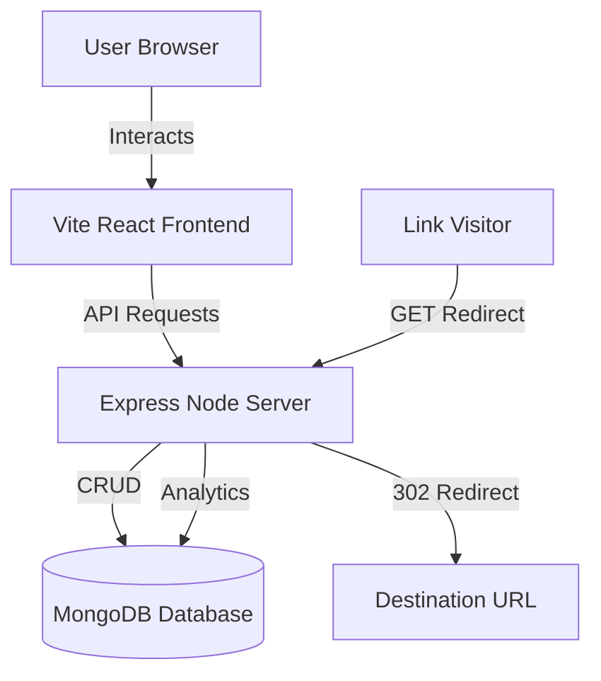

# Zylink – Smart URL Analytics Platform

🔴 **[Live Demo: Zylink](https://fantastic-griffin-32b6bf.netlify.app/)** 🔴

Zylink is a modern, high-performance, full-stack SaaS application that allows users to convert long, complex URLs into short, shareable links. In addition, it tracks real-time visitor engagement (browser, OS, device type, location, and traffic referrers) and supports features like QR Code downloads, custom alias branding, link expiration dates, and bulk URL shortening via CSV uploads.

## 🎨 Tech Stack
- **Frontend:** React, Vite, Tailwind CSS, Recharts (visual charts), Framer Motion (premium animations), Lucide React (vector iconography).
- **Backend:** Node.js, Express.js (REST APIs, routing, input validations).
- **Authentication:** JWT (JSON Web Tokens), Bcryptjs (secure password hashing), Protected route middleware.
- **Database:** MongoDB, Mongoose ODM (structured schemas and analytics aggregations).


## 🏗️ Architecture Diagram




## 📂 Folder Structure


zylink/
├── backend/
│   ├── src/
│   │   ├── config/
│   │   │   └── db.js                 # Database connection config
│   │   ├── controllers/
│   │   │   ├── authController.js      # Auth business logic
│   │   │   ├── urlController.js       # URL shortening & bulk CRUD
│   │   │   ├── analyticsController.js # Aggregations & summary data
│   │   │   └── redirectController.js  # Server redirection and tracking
│   │   ├── middlewares/
│   │   │   ├── authMiddleware.js      # JWT protect verification
│   │   │   └── errorMiddleware.js     # Express general error handler
│   │   ├── models/
│   │   │   ├── User.js                # User collection schema
│   │   │   ├── Url.js                 # URL collection schema
│   │   │   └── Analytics.js           # Visitor analytics logs schema
│   │   ├── routes/
│   │   │   ├── authRoutes.js          # Authentication routing endpoints
│   │   │   ├── urlRoutes.js           # URL configuration routing endpoints
│   │   │   ├── analyticsRoutes.js     # Metrics routing endpoints
│   │   │   └── redirectRoutes.js      # Redirection endpoints (root level)
│   │   ├── utils/
│   │   │   ├── helpers.js             # General URL & code utilities
│   │   │   └── qrCodeGenerator.js     # QR Code base64 png generator
│   │   └── app.js                     # Server entry point
│   ├── .env                           # Local environment configuration (⚠️ DO NOT COMMIT - see .env.example)
│   ├── .env.example                   # Environment variables template
│   └── package.json                   # Server dependencies
└── frontend/
    ├── index.html                     # HTML root template with SEO metadata
    ├── tailwind.config.js             # Theme & styling configurations
    ├── postcss.config.js
    ├── src/
    │   ├── App.jsx                    # Routing & Context Providers
    │   ├── index.css                  # Typography, utilities & dark themes
    │   ├── main.jsx                   # React bootstrapper
    │   ├── components/
    │   │   └── ui/
    │   │       ├── Button.jsx         # Custom premium buttons
    │   │       ├── Card.jsx           # Clean container panels
    │   │       ├── Dialog.jsx         # Animated overlay modals
    │   │       ├── Input.jsx          # Custom styled text inputs
    │   │       └── Toast.jsx          # Framer-motion floating alert toasts
    │   ├── context/
    │   │   ├── AuthContext.jsx        # Login, logout & api request contexts
    │   │   └── ThemeContext.jsx       # Theme state toggles
    │   └── pages/
    │       ├── LandingPage.jsx        # Product landing & widget demo
    │       ├── Login.jsx              # Auth screens
    │       ├── Register.jsx           # Signup validation
    │       ├── Dashboard.jsx          # Link tables & bulk options
    │       ├── AnalyticsDetail.jsx    # Analytics charts & logs
    │       ├── PublicAnalytics.jsx    # Client-facing metrics view
    │       └── NotFound.jsx           # 404 handler
    └── package.json                   # Frontend dependencies
```


## 🔐 Security & Environment Setup

### ⚠️ Critical: Protecting Sensitive Data

**Environment variables contain sensitive information** (database credentials, API keys, secrets). **NEVER commit `.env` files to version control.**

#### Ensure `.gitignore` Contains:
```
backend/.env
node_modules/
dist/
.DS_Store
*.log
```

Check if `.gitignore` exists:
```bash
cat .gitignore
```

If it doesn't exist or needs updating:
```bash
echo "backend/.env" >> .gitignore
echo "node_modules/" >> .gitignore
echo "dist/" >> .gitignore
```


## 🛠️ Setup Guide

### Prerequisites
1. **Node.js:** Ensure Node.js is installed (`node -v` should show version >= 18).
2. **MongoDB:** Make sure a local instance of MongoDB is running at `mongodb://localhost:27017/` or have a MongoDB Atlas cloud URI ready.

### Backend Configuration
1. Open a terminal and navigate to `backend/`.
2. Install dependencies:
   ```bash
   npm install
   ```
3. Create `.env` file from the template:
   ```bash
   cp .env.example .env
   ```
4. Edit `.env` with your actual values:
   ```env
   PORT=5000
   MONGODB_URI=mongodb+srv://<username>:<password>@cluster.mongodb.net/zylink
   JWT_SECRET=your_super_secret_jwt_key_here
   FRONTEND_URL=http://localhost:5173
   NODE_ENV=development
   ```
5. Start the backend server in development mode:
   ```bash
   npm run dev
   ```
   The backend will be running at `http://localhost:5000`.

### Frontend Configuration
1. Open a new terminal and navigate to `frontend/`.
2. Install dependencies:
   ```bash
   npm install
   ```
3. Start the Vite React development server:
   ```bash
   npm run dev
   ```
   The application will be running at `http://localhost:5173`. Open it in your web browser.


## 🚀 API Documentation

### 🔒 Authentication (`/api/auth`)
- **`POST /register`** - Registers a new user.
  - **Payload:** `{ "username": "...", "email": "...", "password": "..." }`
- **`POST /login`** - Log in and retrieve the JWT authorization token.
  - **Payload:** `{ "emailOrUsername": "...", "password": "..." }`
- **`GET /me`** - Return current user details.
  - **Headers:** `Authorization: Bearer <token>`

### 🔗 URL Management (`/api/urls`) (Requires Authorization)
- **`POST /`** - Shorten a URL.
  - **Payload:** `{ "longUrl": "...", "customAlias": "...", "expiryDate": "...", "isPublicAnalytics": true/false }`
- **`GET /`** - Returns the logged-in user's shortened links (paginated & searchable).
- **`PUT /:id`** - Update settings (destination URL, custom alias, activity state, public analytics toggle).
- **`DELETE /:id`** - Permanently deletes the shortened link and its click log records.
- **`POST /bulk`** - Bulk shorten URLs. Accepts an array of objects or raw CSV text content under `{ "csvText": "..." }`.

### 📊 Analytics (`/api/analytics`)
- **`GET /summary`** - (Authorized) Return total link counts, active links, total click counts, last 14 days click trends, and recent logs.
- **`GET /url/:id`** - (Authorized) Return detailed performance logs, device types, locations, and referrer summaries for a specific URL.
- **`GET /public/:username/:code`** - (Public) Return stats for links with `isPublicAnalytics` toggled on.

### 🔀 Redirection Route
- **`GET /:username/:code`** - (Public) Checks link activity and expirations, tracks browser/device/location/referrer, updates counters, and redirects with a 302 code.


## 🌐 Deployment Instructions

### Production Build
1. Build the production assets for the frontend:
   ```bash
   cd frontend
   npm run build
   ```
   This compiles optimized HTML/CSS/JS into `frontend/dist/`.
2. **Deploying the Frontend to Netlify:**
   - The frontend includes a `netlify.toml` file which automatically configures SPA routing rules to prevent 404 errors on page reloads.
   - When importing the repository on Netlify, select the `frontend` subfolder as the base directory.
   - Set the Build Command to `npm run build` and the Publish Directory to `dist`.
3. **Deploying the Backend:**
   - Deploy the Express backend on standard Node.js hosting servers (e.g. Render, Railway, Heroku, AWS EC2, or DigitalOcean).
4. **Environment Mapping:**
   - Point the frontend `API_BASE` configurations and the backend `FRONTEND_URL` environment variables to the production domains.
   - **For production deployment:** Use strong, unique values for `JWT_SECRET` and secure MongoDB credentials. Never use development values in production.


## 📝 Features

✨ **URL Shortening** - Convert long URLs into short, memorable links  
📊 **Real-time Analytics** - Track visitor info (location, device, browser, referrer)  
🎯 **Custom Aliases** - Personalize your shortened links  
⏰ **Expiration Dates** - Set automatic link expiration  
🎨 **QR Code Generation** - Download QR codes for your links  
📤 **Bulk Upload** - Shorten multiple URLs via CSV  
🔒 **User Authentication** - Secure login with JWT  


## 🎬 Project Demo & Explanation

📹 Watch the complete walkthrough of the URL Shortener Project

▶️ YouTube Demo:
https://youtu.be/xMFWFcChjnM

“This project is a part of a hackathon run by https://katomaran.com "

## 📞 Support & Contact

For issues, questions, or suggestions, please open an [Issue](https://github.com/Dharshini-8/Zylink/issues) on GitHub.
For queries contact : vtdharshini8@gmail.com
